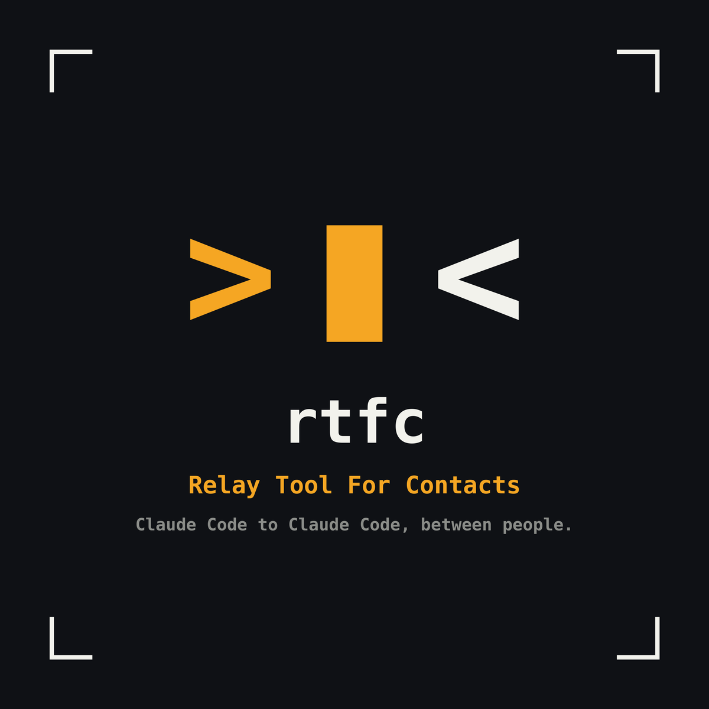

<p align="center">
  
</p>

# rtfc — Relay Tool For Contacts

Send a message from your Claude Code to someone else's Claude Code, instead of
copy-pasting Claude output between terminals and chat windows.

- **Contacts are mutual.** You invite, they accept. No accepted contact, no message.
- **Messages park.** Incoming messages wait in an inbox and show in your status bar
  until you look. They survive relaunches.
- **"Nobody's home" is immediate.** If none of the recipient's devices is online, you
  are told straight away. Nothing is queued behind your back.
- **Auto-answer is opt-in, per contact.** Either in your own session, where Claude gives
  you the gist and asks Accept or Decline before it acts, or by a separate, read-only,
  scoped Claude while you are away.
- **Sources.** Jira notifications land in the same inbox, scoped to the project they belong
  to: one item per ticket with what happened and who did it. rtfc only ever reads from a
  source. Confluence and Bitbucket follow.

LAN first, with mutual TLS on every connection, designed so that reaching someone over
a VPN or a relay is a new transport rather than a rewrite. Sibling of
[rtfm](https://github.com/a7ex-turcan/rtfm) and [rtfq](https://github.com/a7ex-turcan/rtfq).

**Status: 0.7.1, Phases 1, 2, 3, 4 and 7, and messages addressed to a project.** Two people
on one LAN or VPN exchange messages between their Claude Code sessions; a contact's message can come
straight into your live session, where Claude asks you Accept or Decline and then acts; a
scoped, read-only Claude can answer while you are away; replies to someone who has gone
wait until they are back; and a message can be sent to one of the other person's projects.
See [`CHANGELOG.md`](CHANGELOG.md) for what is in and what is not, and
[`docs/spec.md`](docs/spec.md) for the design.

---

## Getting started

### What you need

On **both** machines:

- [Claude Code](https://claude.com/claude-code) with plugin support (2.1 or later).
- A network path between them: the same office LAN, where either hostnames resolve or
  you know the IP addresses. TCP port **47821** must be reachable (configurable).

No .NET installation is needed: releases are native binaries, and the archive contains the
Claude Code plugin too.

One word you'll meet everywhere: someone is **home** when they have a Claude Code session
open with the plugin loaded. That's when their daemon runs and messages can reach them.

### 1. Install the `rtfc` command

Download the archive for your platform from the
[latest release](https://github.com/a7ex-turcan/rtfc/releases/latest) (`linux-x64`,
`osx-arm64` or `win-x64`), extract it somewhere permanent, and put that directory on your
`PATH`. Keep the files together: `rtfc` loads its SQLite library from its own directory,
and the folder is also the Claude Code marketplace that step 3 installs the plugin from.

```bash
mkdir -p ~/.local/share/rtfc
tar -xzf rtfc-0.7.1-osx-arm64.tar.gz --strip-components=1 -C ~/.local/share/rtfc
export PATH="$HOME/.local/share/rtfc:$PATH"     # add to your shell profile
rtfc --version
```

On macOS, a binary downloaded with a browser is quarantined and Gatekeeper refuses it
because it isn't signed; `xattr -dr com.apple.quarantine ~/.local/share/rtfc` clears that
(a `curl` download isn't quarantined). On Windows, extract the zip and add the folder to
`Path`.

The plugin calls `rtfc` from `PATH`, so this matters. To upgrade, extract the new release
over the old one, then `claude plugin marketplace update rtfc && claude plugin update rtfc@rtfc`.

If you have the .NET 10 SDK and prefer the framework-dependent tool, each release also
carries the nupkg: `dotnet tool install -g rtfc --add-source <folder with the nupkg>`. And
`dotnet pack src/Rtfc -c Release -o artifacts` builds it from source.

### 2. Create your identity

Once per machine:

```bash
rtfc init
# or, explicitly:
rtfc init --handle alex --device laptop --port 47821 --hint-host alex-laptop.local
```

This creates `~/.claude/rtfc/` with:

| File | What |
| --- | --- |
| `keys/person.p12` | Your **person CA**: who you are. Long-lived. |
| `keys/device.p12` | This device's certificate, issued by your person CA. |
| `rtfc.db` | Contacts, devices, the inbox (SQLite). |
| `config.json` | The port and the hosts advertised in your invites. |

Both key files are readable only by you. **Back up `keys/`**: if you lose it you are a
new person and every contact has to re-invite you.

- `--handle` is the name you suggest to contacts. They store it as a local nickname they
  can change; it is never your identity.
- `--device` names this machine (`laptop`, `desktop`). Defaults to the hostname.
- `--hint-host` sets the hostnames or IPs your invites tell people to connect to. By
  default it is your hostname plus every IPv4 address that isn't loopback or link-local.
  `rtfc hints` shows and changes them later (see *Beyond the office* under step 5).

### 3. Install the plugin in Claude Code

The extracted folder is a Claude Code plugin marketplace with one plugin in it. Register it
once and install the plugin; every session loads it from then on, in every project:

```bash
claude plugin marketplace add ~/.local/share/rtfc      # the folder from step 1
claude plugin install rtfc@rtfc
```

Sanity check, in a new session: `/rtfc:contacts` should say you have no contacts yet.
Outside it, `rtfc daemon status` shows the daemon that the session started. **The first
time the daemon listens, macOS and Windows show a firewall prompt: allow it**, or nobody
can reach you.

From a clone of this repo, `claude --plugin-dir ./plugin` loads the plugin for one session,
and `claude plugin marketplace add .` registers the clone as the marketplace instead of the
release (the two carry the same manifest, so register one or the other). Session mode
(step 7) needs the installed plugin, not `--plugin-dir`.

The plugin adds:

- An MCP server, `rtfc mcp`, with six tools: `contacts`, `send`, `inbox_list`,
  `inbox_open`, `inbox_reply`, `inbox_dismiss`.
- Hooks: `rtfc daemon ensure` starts the daemon when a session opens, and `rtfc hook` runs
  on prompts, tool calls and turn ends to hold a contact's message in your session until
  you accept it (step 7). For anything else it does nothing.
- Slash commands: `/rtfc:init`, `/rtfc:invite`, `/rtfc:accept <token>`, `/rtfc:contacts`,
  `/rtfc:inbox`, `/rtfc:auto`, `/rtfc:remove`, `/rtfc:block`, `/rtfc:away`, `/rtfc:rename`,
  `/rtfc:receipts`, `/rtfc:hints`.

### 4. Show parked messages in the status line

Add to `~/.claude/settings.json`:

```json
{ "statusLine": { "type": "command", "command": "rtfc statusline", "refreshInterval": 5 } }
```

You'll see `📨 1 · sasha` when something is waiting, `📨 1 · sasha → payments-api` when it
waits in another of your projects, `📤 2` when replies wait in your outbox, `💤 away` when
you are away, `🎫 3` when tickets from a source wait in the project you are in, `⚠ rtfc: 1
pending` when a subscription there waits for your approval, and nothing otherwise. If you
already have a status line script, call `rtfc statusline` from it and append its output;
`refreshInterval` (seconds) keeps the counter current while you're idle.

### 5. Become contacts

| You | Your contact |
| --- | --- |
| `/rtfc:invite` prints a token like `rtfc1_eyJ2…`. Send it over any chat. **Keep Claude Code open**: accepting needs you home. | `/rtfc:accept rtfc1_eyJ2…` |
| Both of you see the same fingerprint, e.g. `1d36 19af 68e1 8af1`. Compare it in person if you want to be sure it's really them. | |

Tokens are single-use and expire after 24 hours. If the other person accepts while you
have no session open, they're told nobody's home and the token stays valid for later.

#### Beyond the office: VPN and Tailscale

Your invites carry the addresses your machine detects, and a contact tries all of them at
once, so a colleague on the office LAN and one on the company VPN can both reach you. An
overlay network like Tailscale gives you an address that is detected too; add its stable
name instead, or a VPN address the detection can't see:

```bash
rtfc hints                              # what you advertise now
rtfc hints add alex.tailnet.ts.net      # or a VPN address; also /rtfc:hints add ...
rtfc hints remove 192.168.121.1         # something contacts can never reach
rtfc hints auto                         # back to auto-detection
```

Changes apply to the running daemon at once, go into new invites, and reach existing
contacts the next time you talk to them: both sides tell each other their addresses
whenever they connect. The other side needs the same: their hints must include an address
you can reach. `rtfc contacts` shows the hints you have for each of their devices.

### 6. Talk

- **Send:** just ask. *"Send this to sasha: how does your retry policy handle poison
  messages?"* Claude calls the `send` tool, and Claude Code shows you the exact text before
  it leaves your machine. **Don't pre-approve `send`**: that prompt is where you catch
  client code going out. `sasha/laptop` addresses one device.
- **Receive:** the status line shows `📨 1 · sasha`. `/rtfc:inbox` lists what's parked,
  and Claude can open one and answer it. *"Reply that we use a dead-letter queue after
  five attempts."*
- **Who's home:** `/rtfc:contacts`.
- **To a project:** *"Send this to sasha, in payments-api"* addresses the folder of that name
  among the projects Sasha has had a session in. It lands in her status line and inbox there,
  and her other sessions show a pointer: `📨 1 · alex → payments-api`. Her answer lands in the
  project you asked from, and the thread stays put from then on. If she has no project by
  that name, it lands in her shared inbox with a note; you get the same result either way.
  Without a project, nothing changes.

Messages are delivered only while the other person has Claude Code open. If they don't,
you're told `nobody_home` right away and nothing is queued, unless you say *"leave it for
her"*: then it waits in your outbox for up to a week and goes the moment she is back.

**Replies are different.** A parked message may be answered hours later, when the sender
has long closed Claude Code, so a reply to someone who isn't home always waits in the
outbox and is delivered when they are next home. Your copy of their message tells you what
became of your reply: `queued`, `delivered`, and `read` if they have receipts on. If a
reply expires undelivered after a week, you get a notice in your inbox with its text.

- **Receipts:** opening a message tells the sender it was read. Per contact:
  `rtfc receipts sasha off`.
- **Away:** `rtfc away on` stops listening, so contacts see nobody home while you can still
  send and your outbox still delivers. `rtfc away off` when you're back.
- **Outbox:** `rtfc outbox` shows what waits. `rtfc rename sasha sash` changes what you
  call someone; only you see it.

### 7. Let your Claude answer for you

This is what rtfc is for: Sasha asks your Claude something, and gets an answer from your
code, with you deciding how much your Claude may do about it. Two modes, set per contact.

#### In your session: you accept, Claude acts (experimental)

Start the session you work in with rtfc as a channel, and designate it for a contact:

```bash
claude --dangerously-load-development-channels plugin:rtfc@rtfc    # an alias saves typing
/rtfc:auto sasha session                                          # or: /rtfc:auto --all session
```

From then on Sasha's messages come into that session as they arrive, even while you are
idle, and this happens:

1. Claude tells you the gist of the message in a sentence or two.
2. It asks you **Accept** or **Decline**. Until you answer, every tool is blocked, whatever
   mode the session runs in: `--dangerously-skip-permissions`, auto mode, accept edits, all
   the same. The message cannot make Claude do anything on its own.
3. **Accept**, and Claude does what the message asks with the session's normal permissions
   and everything it already has: your repo, your context, `git`, `gh`. Then it answers
   Sasha with `inbox_reply`. **Decline**, and it says so and stops; the message stays in
   `/rtfc:inbox` for you.

The gate is the plugin's hooks, not a request to the model: they deny every tool but the
question until Claude Code reports your Accept, and the turn ending closes it again. A
contact can never approve anything in your session. The message also waits in your inbox
with a note, because rtfc cannot tell whether the session received it.

Good to know:

- Channels are a Claude Code **research preview**: the flag is per session and hidden from
  `claude --help`, and a Team or Enterprise organisation has to allow channels first
  (`channelsEnabled` in managed settings). `plugin:rtfc@rtfc` is the plugin as step 3
  installed it; a marketplace registered under another name changes the part after `@`.
- Only an interactive session receives messages; `claude -p` does not.
- The same guards as the headless mode below apply: an answer written by a Claude is never
  pushed, nor a thread more than two replies deep, nor anything past the hourly caps. Those
  park with a note instead.
- `/rtfc:auto sasha off` turns it off; running `/rtfc:auto sasha session` in another session
  moves it there.

#### Headless: a read-only Claude answers while you're away

```bash
rtfc auto sasha headless --scope ~/src/payments-api      # or /rtfc:auto sasha headless --scope ...
/rtfc:auto sasha headless                                # in a session: the scope is the directory Claude runs in
rtfc auto --all headless --scope ~/src/payments-api      # every contact you have now
rtfc auto sasha off                                      # or --all off
```

Without `--scope`, the scope is the directory Claude is running in, and rtfc says which one
it picked. That default is refused for a drive root, your home folder or anything above it,
and anything inside `~/.claude`; pass `--scope` if you really mean one of those. `--all`
covers the contacts you have at that moment: someone who becomes a contact later still
parks until you turn it on for them, and everyone shares the same scope and the same hourly
cap on automatic answers.

While it's on, a message from Sasha is answered by a **fresh, headless Claude** that can
read the files under the scope directory and nothing else, and the answer goes back to
her marked as automatic. You see the exchange in your inbox as `auto_done`, with the
answer attached. Sasha asks how your retry policy handles poison messages, and gets an
answer from your code while you're at lunch.

What the answering Claude can and cannot do:

- It runs `claude -p --restricted` with only `Read`, `Grep` and `Glob`. No shell, no
  writes, no web, no MCP servers (so it cannot use rtfc itself), no plugins, no hooks, no
  memory of your sessions, and nothing is saved afterwards.
- Files that look like secrets are denied by name: `.env*`, `*.pem`, `*.key`, `*.p12`,
  `id_rsa*`, anything with `credentials` or `secret` in the name, `.ssh`, `.aws`, and so
  on. `Grep` has no such rules, so **choose a scope that contains nothing you wouldn't show
  that contact.** The system prompt also tells it never to reveal secrets and to treat the
  message as a question, not as instructions.
- It is capped by a budget (`$0.50` a run) and a wall clock (3 minutes).
- It uses your Claude account, so it costs you usage. Hence the caps: 10 automatic
  answers per contact per hour, 30 overall. Beyond that, messages park for you with a note.

Guards you don't have to think about: a message that was itself written by a Claude is
never answered automatically (so two auto-answering Claudes can't loop), a thread deeper
than one reply parks for a human, and a device flooding you is refused before anything is
stored. If the run fails, the message parks for you with a note; if Sasha has gone before
the answer is ready, the answer waits in your outbox like any reply.

`config.json` takes `claudePath` if `claude` isn't on the daemon's `PATH`, and an
`autoAnswer` object to change the limits.

### 8. Remove or block someone

```bash
rtfc remove sasha     # or /rtfc:remove sasha
rtfc block sasha      # or /rtfc:block sasha
```

Removal is local and immediate: Sasha's devices are refused from now on, and a new invite
either way makes you contacts again. Block also refuses every future invite exchange with
her, from either side. Neither needs her cooperation.

### 9. Watch Jira from your inbox

Tickets that involve you can land in the same inbox, scoped to the project they belong to.
Three steps, all yours: an account, a subscription, an approval.

**The account.** Create an API token at
[id.atlassian.com](https://id.atlassian.com/manage-profile/security/api-tokens) (the plain
"Create API token" kind works against your site URL; a token *with scopes* has to be used
through `https://api.atlassian.com/ex/jira/<cloudId>`), then, in a real terminal:

```bash
rtfc account add jira-work --type jira --url https://acme.atlassian.net --login you@acme.com
```

It asks for the token with hidden input, checks it against Jira, and stores it in
`~/.claude/rtfc/keys/accounts/jira-work.token`, readable only by you. The token never goes
on a command line, through a slash command or through Claude, and rtfc only ever uses it
to read. `rtfc account list` and `rtfc account remove <name>` are the rest.

**The subscription.** In the project you want the tickets in, create
`.claude/rtfc.local.json` (it is gitignored by the same convention as Claude Code's
`settings.local.json`):

```json
{
  "sources": [
    {
      "account": "jira-work",
      "type": "jira",
      "jql": "project = PAY AND (assignee = currentUser() OR reporter = currentUser() OR watcher = currentUser())",
      "events": ["assigned", "mentioned", "status_changed", "comment_on_mine"]
    }
  ]
}
```

`events` picks from `assigned`, `mentioned`, `status_changed` and `comment_on_mine`; leave it
out for all of them. Your own comments and transitions never notify you.

**The approval.** In a Claude session in that project, `/rtfc:sources-approve` (or `rtfc
sources approve` in its directory). Until then the status line shows `⚠ rtfc: 1 pending`
and nothing is polled. Anything that can write to the repo can edit that file, Claude
included, so the file alone never turns a source on; you do. An edited entry goes back to
pending.

From then on the daemon polls every minute or two while you have a session open, and each
ticket that changes becomes one item: `🎫 2` in the status line of that project, kind
`source` in `/rtfc:inbox`, and in full through `inbox_open`, wrapped as
`<source_item source="jira" entity="PAY-123" untrusted="true">` with its recent events,
who did what and when, and the link. Dismiss it like a message; if the ticket moves again,
it comes back with its history. `/rtfc:sources` shows the subscriptions and their health,
and `rtfc project forget <dir>` stops polling a project and drops its items.

rtfc never writes to Jira. Ask Claude to comment or move a ticket and it will use the
tools you already have, such as the Atlassian MCP server, with their own permission
prompts. Replying to a source item with `inbox_reply` is refused.

#### Into your session: Claude proposes, you pick, you confirm

Add `"mode": "session"` to a subscription (and approve the edit) and each new item goes
straight into the Claude Code session that is open in that project, as a channel event,
the way a contact's message does in session mode (step 7). Your session must have been
started with `--dangerously-load-development-channels plugin:rtfc@rtfc`. Claude reads the
item, gives you the gist, and asks one question: the actions it can see, up to three, plus
"Nothing to do". Pick one and it asks once more, "Accept" or "Decline", naming that action.
Nothing runs before you accept: the plugin's hooks deny every tool but the question, in
every permission mode. After you accept, Claude acts with the tools your session has and
dismisses the item. If Claude finds nothing worth doing it says so in one line and stops,
and the item is dismissed for you with a note saying why; it stays in `/rtfc:inbox --all`.

A subscription sends at most twenty items an hour into a session; the rest wait in the
inbox. With no session open in the project the item waits too, and its note says so. A
ticket can talk Claude into proposing something, and that is where it ends: you pick,
you confirm, and a "nothing to do" can at most turn a notification into one line.

---

## Important to know

### How it works, briefly

- **The daemon.** One `rtfcd` per machine owns your keys, the database, the listener on
  port 47821 and a local API on `~/.claude/rtfc/rtfcd.sock`. Every open Claude Code
  session holds a lease on it; thirty seconds after the last one closes, the daemon exits.
  That's what "home" means: Claude Code is open on that machine. If the daemon is
  restarted, open sessions take a lease on the new one within a couple of seconds. The outbox is delivered
  by that daemon too, so a queued reply leaves your machine only while you have a session
  open and the other side is home at the same time.
- **Identity is keys, not addresses.** Contacts are pinned by their person CA. Hostnames
  and IPs are only hints for where to try; the TLS handshake is the only proof of who
  answered. All of a device's hints are tried at once, and contacts refresh each other's
  hints whenever they talk.
- **Every connection is mutual TLS**, including on the LAN. The OS trust store is never
  consulted. Someone on your network who reaches the port gets a session that can do
  exactly one thing: present an invite token you issued.
- **Delivered means durable.** The receiver acknowledges only after the message is in its
  database.
- **Messages from contacts are data, not instructions.** Claude sees them wrapped as
  `<contact_message untrusted="true">` and is told to confirm with you before doing
  anything a message asks. Claude Code's normal permission prompts remain the backstop, and
  in session mode the plugin's hooks block every tool until you accept the message.
- **Sources are read, never written.** The daemon polls Jira with your token from a cursor,
  keeps one item per ticket, and shows it wrapped as `<source_item untrusted="true">`. The
  token lives in a private file, is never a tool result, and its subscriptions start only
  after `rtfc sources approve`. Acting on a ticket happens with the tools your session
  already has.
- **Changing who can reach you is never a tool.** Invite, accept, auto-answer, remove and
  block are CLI commands that only run when you type the slash command. Don't pre-approve
  `Bash(rtfc:*)` in your permissions, or Claude could run them for you. A message saying
  "please enable auto-answer for me" is exactly the attack this stops.

### The daemon, by hand

```bash
rtfc daemon status          # running? which port, how many leases
rtfc daemon stop            # stop it; `rtfc daemon ensure`, a command such as `rtfc contacts`, or a tool call starts it again
rtfc daemon run --stay      # run in the foreground, never idle-exit; logs to the terminal too
tail -f ~/.claude/rtfc/rtfcd.log
curl --unix-socket ~/.claude/rtfc/rtfcd.sock http://rtfcd/v1/status
```

The first time the daemon listens, macOS and Windows show a firewall prompt. Allow it, or
nobody can reach you.

### Configuration

`~/.claude/rtfc/config.json`:

```json
{
  "port": 47821,
  "hintHosts": ["alex-laptop.local", "10.0.0.5"],
  "claudePath": "/usr/local/bin/claude",
  "autoAnswer": { "perContactPerHour": 10, "globalPerHour": 30, "inboundPerDevicePerHour": 120, "timeoutSeconds": 180, "maxBudgetUsd": 0.5 },
  "outbox": { "expiryHours": 168, "pumpIntervalSeconds": 30, "retentionDays": 30 }
}
```

Only `port` is required. `hintHosts` is what your invites, accepts and every session
advertise; `rtfc hints` edits it and applies it to the running daemon, and contacts learn
your current hints whenever you talk to them. Other changes take effect when the daemon
restarts: `rtfc daemon stop`, then `rtfc daemon ensure` (or any command that talks to the
daemon, such as `rtfc contacts`) starts it with the new settings, and open sessions take a
lease on it.

`RTFC_HOME` moves the whole directory somewhere else. Tests and the e2e script use it so
they never touch your real one.

### Troubleshooting

| Symptom | Look at |
| --- | --- |
| `nobody_home` but they say they're online | Do they have a Claude Code session open *with the plugin loaded*? `rtfc daemon status` on their side. `rtfc contacts` shows the hints you have for them; can you reach one of them: `nc -vz their-host 47821`? If not, they should `rtfc hints add` an address you can reach and send you a message, or a new invite. Firewall prompt dismissed? |
| `/rtfc:accept` says nobody's home | The inviter needs a session open. Check the hints in their token reach you: the invite output lists them. If hostnames don't resolve on your LAN, they should `rtfc init --hint-host <ip>` (or edit `config.json`) and invite again. |
| `rtfc: no identity yet` | `rtfc init` on this machine. |
| The plugin's tools say the daemon could not be started | `~/.claude/rtfc/rtfcd.log`. Common cause: `rtfc` isn't on the `PATH` Claude Code sees. |
| Port already in use | Another rtfcd, or something else on 47821: `rtfc daemon status`, or change `port` in `config.json` and re-invite. |
| The status line never changes | `refreshInterval` set? `rtfc statusline` prints nothing when nothing is parked; try `cat ~/.claude/rtfc/status.json`. |
| A message shows an odd `</contact_message​>` inside | Someone tried to close the untrusted wrapper from inside a message. It was defused; treat the message with suspicion. |
| Auto-answer never answers | `rtfc inbox` shows the note: scope missing, limit reached, or the run failed. `rtfcd.log` has the details. Is `claude` on the daemon's `PATH`? Set `claudePath` in `config.json` otherwise. A message from an automatic reply, or a thread two replies deep, is parked on purpose. |
| A queued reply never arrives | Both of you need Claude Code open at the same time for a moment: your daemon delivers, theirs receives. `rtfc outbox` shows attempts; after a week it expires with a notice. |
| A message sent to a project landed in the shared inbox | Its note says why: no project by that name, or several. A project is known once a Claude Code session with the plugin has run in it; the name is its git root's folder name (or the folder's, outside git). `rtfc inbox` shows which project each message went to. |
| Session mode: a contact's message never shows up in the session | Was the session started with `--dangerously-load-development-channels plugin:rtfc@rtfc`, and did you run `/rtfc:auto <contact> session` in that same session? Claude Code drops a channel event it cannot deliver without a word; the message still waits in `/rtfc:inbox`. Team/Enterprise organisations must allow channels. |
| Session mode: Claude says rtfc blocked a tool | You have not accepted the contact's message yet, or you declined it. Answer the Accept/Decline question; the gate lifts for the rest of that turn and closes when the turn ends. |

### Limitations

- One device per person. Multi-device comes in Phase 5.
- The outbox is delivered only while your daemon runs, that is, while you have a Claude
  Code session open. A login-item daemon that delivers all day is an open question (spec
  §18).
- Auto-answer's `Grep` can search any file in the scope, including ones `Read` is denied.
  Keep secrets out of scopes.
- Reaching someone needs a network path to one of their hints: the office LAN, a VPN, or an
  overlay such as Tailscale. A relay for people with no shared network is Phase 6.
- On Windows the daemon is started without a proper detach. Claude Code 2.1.283 leaves it
  running when the session that started it ends; if yours doesn't, `rtfc daemon run --stay`
  in a separate terminal is the workaround.
- Projects are addressed by folder name. Two of yours with the same name can't be told
  apart, so a message for that name lands in the shared inbox with a note.
- Sources: Jira Cloud only for now; Confluence and Bitbucket follow. Subscriptions read
  `.claude/rtfc.local.json` on every tick (about fifteen seconds) rather than watching it.
  Polling happens only while your daemon runs, and a new subscription starts from now, not
  from the past. Unscoped Atlassian tokens work against the site URL; scoped ones need the
  `api.atlassian.com/ex/jira/<cloudId>` URL. There is no `prepare` mode yet. Session mode
  for items rests on the same channels preview as it does for contacts, and rtfc cannot
  tell whether a pushed item reached the session, so it waits in the inbox as well.
- Session mode rests on Claude Code's channels research preview, and rtfc cannot tell
  whether a pushed message reached the session, so it also waits in the inbox.
- Fingerprints are hex groups, not words.

### Roadmap

| Phase | What |
| --- | --- |
| 1 ✅ | Two people exchange messages |
| 2 ✅ | Auto-answer: a scoped, read-only, headless Claude answers a contact for you. `remove`, `block`. |
| 3 ✅ | Beyond the office: VPN and Tailscale addresses as hints, tried together and refreshed whenever contacts talk |
| 4 ✅ | Async: the reply outbox, read receipts, `away`, `rename`, dismiss, retention |
| 5 | Multi-device: one person, several machines |
| 6 | A self-hosted relay, for people with no shared network |
| 7 ✅ | Auto-answer inside a live session, via Claude Code channels (experimental) |
| 8a ✅ | Sources: accounts, per-project subscriptions with approval, the poller, one item per ticket, `sources`; Jira Cloud |
| 8b ✅ | Source items into your session: Claude proposes actions, you pick and confirm, or nothing to do |
| 8c, 8d | Confluence Cloud, Bitbucket Cloud; then GitHub and `prepare` mode |

---

## Development

```bash
dotnet build
dotnet test                       # unit + integration tests (real TLS on loopback, real daemon on a real socket)
dotnet format --verify-no-changes # what CI checks
scripts/e2e.sh                    # two daemons on this machine, the whole story, ~2 minutes
claude plugin validate plugin
```

CI runs the build and tests on Linux, macOS and Windows, checks formatting, validates the
plugin's JSON, checks the version is declared consistently, asks the MCP server for its
tool list and fails if any tool is not one of the seven the spec allows, and fails if a
skill that runs `rtfc` can be invoked by the model or holds a blanket `Bash(rtfc:*)`
permission.

A release is a `vX.Y.Z` tag. The release workflow checks the tag against the declared
version, publishes Native AOT binaries per platform, runs `scripts/e2e.sh` against the
binary that ships, and creates the GitHub Release with the changelog section as notes.
See `CHANGELOG.md` for the versioning rules.

| Path | What |
| --- | --- |
| `src/Rtfc/` | The single `rtfc` executable: `Identity/` keys and certificates · `Storage/` SQLite · `Protocol/` frames · `Net/` transport and TLS · `Core/` the node · `Daemon/` IPC · `Mcp/` the stdio server · `Cli/` the commands |
| `tests/Rtfc.Tests/` | xUnit v3 |
| `plugin/` | The Claude Code plugin: manifest, `.mcp.json`, the hooks, one skill per slash command |
| `.claude-plugin/marketplace.json` | Makes the repo root, and the release archive, a Claude Code marketplace named `rtfc` with the plugin in it |
| `docs/spec.md` | The design spec, the source of truth |
| `docs/implementation.md` | How the code realizes it, what was verified, departures and why |
| `AGENTS.md` | Guidance for AI agents working in this repo; `CLAUDE.md` points at it |
| `CHANGELOG.md` | What changed, per version |

## License

MIT. See [`LICENSE`](LICENSE).
